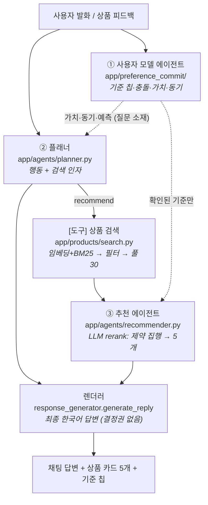
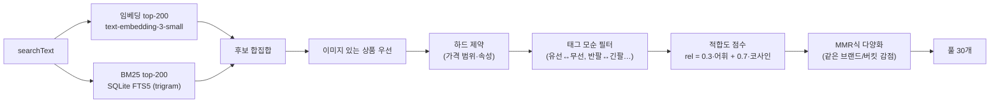
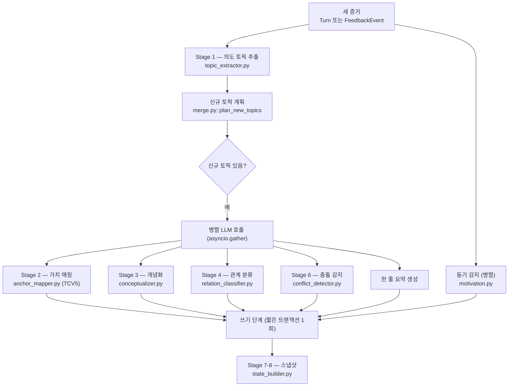

# ValueCommit 방법론 개요 — 추천은 어떻게 되고, 사용자의 숨은 의도는 어떻게 반영되는가

> **대상 독자:** 이 프로젝트를 처음 보는 다른 팀.
> **범위:** 런타임 대화 1턴이 어떻게 처리되는지 — ① 추천 파이프라인, ② 사용자 의도(가치·동기) 추론,
> ③ 그 의도가 추천에 닿는 (그리고 일부러 닿지 않게 막아둔) 경로.
> **기준 시점:** 2026-07-27, `main` 브랜치 코드 기준. 파일 경로는 모두 `valuecommit/backend/` 기준.

### 이 문서를 어디까지 믿어도 되나 (검증 상태)

| 구간 | 근거 | 신뢰도 |
|---|---|---|
| §1–§6 아키텍처·데이터 흐름·상수 | 해당 소스를 직접 읽고 작성 (`service_agent.py`, `planner.py`, `recommender.py`, `commit_engine.py`, `state_builder.py`, `search.py`, `prompts.py`, `levels.py`) | **높음** — 함수·상수 단위로 대조 가능 |
| §4.4 종단 트레이스 | 로컬 `amazon_ko.db`의 실제 `llm_calls`·`turns`·`product_impressions` 레코드 | **높음** — 원본 레코드 존재 |
| 설계 *이유* (evidence purity, NevIR 분업 등) | `docs/plans/2026-07-02-three-agent-crs-redesign.md` + 코드 주석 | 중 — 설계 의도의 기록이지 실증이 아님 |
| §7 한계의 정량 수치 | 일부는 이전 분석 세션 결과로 **레포에 산출 스크립트 미보존** (해당 항목에 ⚠️ 표기) | **낮음** — 인용 전 재산출 필요 |
| §9 소비자 이론 인용 | 저자·연도만. 레포에 서지정보·검증 기록 없음 | **낮음** — 원문 확인 필수 |

**이 문서에 없는 것:** 정량 평가 결과("이 방법론이 얼마나 잘 되는가"). 현재 레포에 있는
평가 자산은 `scripts/eval_planner_searchtext.py`(검색문 품질), `tests/test_acceptance.py`
(mock 기반 회귀), `scripts/analyze_pscon.py`(실대화 배치 분석)이고, **연구 수준의 종단 평가는
아직 수행 전**이다. §7을 반드시 함께 읽을 것.

---

## 0. 5분 요약

**이건 추천 정확도를 올리는 시스템이 아니다.** HCI 연구 프로토타입이고, 연구 질문은
"대화형 에이전트가 **사용자가 말하지 않은 결정 기준(hidden intention)** 을 추론해서, 그걸
사용자에게 **보여주고(외재화), 사용자가 고칠 수 있게(correctable)** 만들 수 있는가"이다.
추천은 그 자체가 목적이 아니라 **관측 도구**다 — 사용자에게 상품을 보여줘야 선택/거절이라는
증거가 생기고, 그 증거에서 숨은 기준을 역추론할 수 있기 때문이다.

한 턴에서 벌어지는 일:

```
사용자 발화
  ├─(A) 사용자 모델 갱신 ── 발화·피드백에서 "왜 그게 중요한가"를 추출 → 기준 칩 + 가치/동기 추론
  └─(B) 다음 행동 결정 ──── recommend / clarify / answer / close 중 하나 + 검색 인자 생성
          └─ recommend면 → 임베딩+BM25 검색(풀 30) → LLM rerank(제약 집행) → 5개 노출
  → 렌더러가 최종 한국어 답변을 작성 (추측·확인형 어투)
```

세 가지만 기억하면 된다:

| # | 핵심 설계 | 한 줄 이유 |
|---|---|---|
| 1 | **의도 추론과 상품 선별을 다른 LLM 호출로 분리** | 한 호출에 두면 모델이 자기가 고른 상품을 정당화하려고 사용자 가치를 역산(back-rationalize)해서, 연구 종속변인이 오염된다 |
| 2 | **검색어(긍정)와 제약(부정)을 분리** | 임베딩 검색은 부정을 못 읽는다. "스키니는 싫어요"를 쿼리에 넣으면 스키니가 더 잘 검색된다 (NevIR, EACL'24) |
| 3 | **추론된 가치 점수는 랭킹에 직접 쓰지 않는다** | 미확인 추론이 추천을 움직이면 (a) 피드백 증거가 오염되고 (b) "칩을 고치면 추천이 바뀐다"는 인과가 보장되지 않는다. 가치는 *질문의 소재*로만 쓰고, 사용자 확인을 통과해야 랭킹에 닿는다 |

---

## 1. 전체 구조 — 3 에이전트 + 도구 1 + 렌더러 1

설계 근거 문서: `docs/plans/2026-07-02-three-agent-crs-redesign.md`



**분리 지점(이음새)을 세 곳에만 둔 이유:**

1. **임베딩 검색 = 물리적 강제.** 카탈로그 1.1만개는 LLM 컨텍스트에 안 들어가고, LLM의
   파라메트릭 지식에도 없다. 그래서 `LLM(이해→쿼리) → [검색 도구] → LLM(선별)` 분할은
   선택이 아니라 강제다.
2. **의도 추론 ↔ 서비스 = 인식론적 강제.** (위 표 #1)
3. **LLM-first, write-last = 동시성 강제.** (§6 참조)

각 에이전트의 권한 경계:

- **사용자 모델(①)** 은 사용자 모델의 **유일한 쓰기 주체**다 (사용자 본인의 칩 수정 제외).
- **플래너(②)** 에는 **상품 ID가 흐르지 않는다.** 무엇을 보여줄지는 전적으로 ③의 몫.
- **렌더러**는 **아무 결정도 하지 않는다.** 이미 확정된 사실(노출 셋, 질문, 충돌)을 한국어로 옮길 뿐.

---

## 2. 추천은 어떻게 되는가 (Part A)

### 2.1 왜 "검색 → rerank" 2단계인가

임베딩(bi-encoder)은 **의미 근접**은 잘 잡지만 **부정·제약**을 못 읽는다 (NevIR, EACL 2024:
부정 이해에서 랜덤 이하). 예산 초과, "커널형 싫어요", "여성용 말고" 같은 조건은
**후보를 실제로 읽는 LLM**만 집행할 수 있다. 그래서:

- **1단계 (recall)**: 넓게 30개를 건져 온다 — 값싸고 빠르되 제약은 무시.
- **2단계 (precision)**: LLM이 30개를 읽고 제약 위반을 배제하고 순서를 다시 매긴다.

### 2.2 플래너가 검색 "사양"을 만든다

플래너는 검색을 실행하지 않는다. 검색 **인자 2개**를 만든다 (`app/llm/prompts.py::ACTION_DECISION_SYSTEM`):

| 인자 | 담는 것 | 예시 |
|---|---|---|
| `searchText` | 찾는 **제품 종류 + 사용자가 직접 말한 긍정 특징**만. 대화 전체를 반영한 독립 검색문 (conversational query rewriting) | `"출퇴근용 가방"` |
| `constraintsNote` | 예산·필수조건·비선호·수령자 맥락을 자연어 한두 문장으로 | `"노트북이 들어가야 함, 15만원 이하"` |

원문: `"출퇴근할 때 노트북 넣고 다닐 가방 찾아요, 15만원 넘으면 부담돼요"`

여기서 `노트북`을 `searchText`에 넣으면 **노트북이 검색된다**. 곁에 언급된 물건·상황·받는 사람
(선물·생일 등)·피하려는 것의 이름은 전부 `constraintsNote`로 보낸다. 이 분업이 이 시스템에서
검색 품질을 가장 크게 좌우한다.

> **참고:** `searchText` 생성 프롬프트는 DSPy로 오프라인 컴파일해서 개선했다.
> 실측: 이식 전 **0.741** → 이식 후 **0.909** (23케이스 평균, 채점 = 검색문 적합도 `fit` −
> 오염 토큰 감점). 근거 파일: `backend/data/planner_searchtext_eval_preport.json` /
> `..._postport.json`, 컴파일 리포트 `..._dspy_searchtext_report.json`(고립 Signature
> 0.788→0.975), 스크립트 `scripts/dspy_compile_searchtext.py` · `scripts/eval_planner_searchtext.py`.
> DSPy는 컴파일러로만 쓰고 서빙 경로·`requirements.txt`에는 들어가지 않는다.

### 2.3 검색 (도구) — `app/products/search.py::search_products`



- **하이브리드인 이유:** dense 검색은 "타입 명사"에 약하다 (Sciavolino et al., EMNLP'21).
  어휘 팔(BM25)이 정확한 카테고리명·속성어 일치를 보정한다. `VC_HYBRID_ALPHA` 기본 0.3.
- **랭킹은 value-blind (2026-07-02부터).** 예전엔 여기서 "가치 적합도" 키워드 규칙으로 점수를
  올렸는데 전부 제거했다 — 이유는 §4.
- **카테고리 하드필터 없음.** "노트북이랑 같이 쓸 모니터"에서 카테고리를 잘못 잡아 정답을
  지우는 사고가 있었다. 카테고리 판단은 의미검색 + rerank에 맡긴다.
- **상품 텍스트는 오프라인 LLM 프로필로 정규화되어 있다** (`product_profiles.json`:
  `profile`/`productType`/`audience`/`keyAttributes`/`caveats`). 임베딩에는 **정체성 필드만**
  넣는다 — 프로필 산문(용도 묘사)을 넣었더니 "운동할 때 쓰기 좋은"류 표현이 카테고리를 넘어
  울려서 노트북 질의에 이어폰이 딸려 나왔다.

### 2.4 LLM rerank — 제약 집행 + 노출 셋 확정

`app/agents/response_generator.py::rerank_by_intent` + `app/llm/prompts.py::RERANK_SYSTEM`

rerank에 들어가는 **Goal 컨텍스트**(`recommender.build_rerank_context`):

```json
{
  "scenario": "…쇼핑 목표…",
  "recentUtterances": ["최근 사용자 발화 원문 4개"],
  "statedConstraintsNote": "플래너가 요약한 제약",
  "criteria": [{"label": "…", "description": "…"}]   // ← 명시 또는 사용자 확인 기준만 (§4)
}
```

LLM은 후보 30개 **전부**에 순위 + 카드 텍스트를 매기고, 제약 위반 후보에는 `exclude:true`와
한 구절짜리 이유를 붙인다. 판단 원칙(프롬프트):

1. **제약이 1순위** — 예산 초과, 비선호 속성, 상품 종류·대상(audience) 불일치 → exclude
2. 통과 후보들 사이에서는 `criteria`·발화 원문 적합순
3. **인기 편향 금지** — 유명 브랜드·리뷰 많음 자체로 올리지 마라
4. **순서 편향 금지** — 입력 번호는 임베딩 유사도순일 뿐 정답이 아니다
5. **상위 5개는 보완적으로 구성** — 가성비형/검증형/특색형/프리미엄형/기본형처럼 **강점이
   서로 다른** 5개. (이게 관측 도구의 핵심: 조건은 다 맞고 *가치 방향만 다른* 선택지를 줘야,
   사용자가 무엇을 고르는지가 숨은 기준의 증거가 된다.)
6. 사실 가드 — 후보 정보에 없는 사양은 지어내지 않는다

`temperature=0.0` — 집행 레이어는 최대 결정론. (0.1에서도 동일 입력의 exclude 판정이
런마다 뒤집혔다.)

### 2.5 노출 셋 확정 — "② 부분 정직"

`recommender.select_shown`:

| 상황 | 노출 |
|---|---|
| 제약 준수 후보 ≥ 1개 | 준수 후보 상위 **최대 5개** (5개 미만이면 그만큼만 — **빈칸을 위반품으로 채우지 않는다**) |
| 준수 후보 0개 | rerank 순위 상위 **3개**를 "가장 가까운 대안"으로, **무엇이 다른지 명시하고** 노출 |

준수 후보가 0일 때 5칸을 가득 채우면 고지가 있어도 정상 추천처럼 읽힌다 — 그래서 3개로 줄인다.
그리고 "요청과 다른 점"은 채팅 버블뿐 아니라 **각 카드의 `weak` 맨 앞에도 병합**해서
`ProductImpression`으로 영속화한다 (나중에 연구 분석 가능).

### 2.6 답변 생성

노출 셋이 **먼저** 확정되고, 그 다음에 렌더러가 **실제로 보여준 상품에 근거해서** 답변을 쓴다
(먼저 말하고 나중에 상품을 붙이는 순서가 아니다 — 환각 방지). 렌더러는 spec §36에 따라
단정하지 않는다: "이번 상황에서는 ~을 중요하게 보고 계신 것 같아요", "맞는지 확인해 주세요".

---

## 3. 사용자 의도(가치·동기)는 어떻게 파악되는가 (Part B)

### 3.1 증거는 세 채널에서 온다

| 채널 | 무엇이 증거인가 | 성격 |
|---|---|---|
| **추천 = 프로브** (관찰) | 5개 중 무엇을 고르고 무엇을 거절했는가 + 그 이유 | 연속·수동, 모든 추천 턴 |
| **외재화·수정** (칩·충돌 카드) | 시스템 추론에 대한 사용자의 확인/거부/수정 | 연속·수동, 모든 추론 |
| **clarify 질문** | 사용자가 답한 내용 | 이벤트 구동, 정보 부족하거나 가설 확인 가치 있을 때만 |

**직접 물으면 그건 stated preference지 hidden intention이 아니다** — 측정이 설문으로 퇴화한다.
그래서 elicitation의 무게중심을 "질문"에서 "관찰 + 외재화"로 옮겼다. 이게 고전 CRS
(ask-vs-recommend 정책, EAR/WSDM'20)와 갈라지는 지점이다.

### 3.2 Preference Commit 파이프라인

새 증거(턴/피드백)를 현재 선호 상태에 대한 **커밋**으로 취급한다.
`app/preference_commit/commit_engine.py::run_preference_commit`



#### Stage 1 — 의도 토픽 추출

핵심 지시: **"무엇을 원하는가"가 아니라 "왜 그것이 중요한가"를 뽑아라.**

| 나쁜 토픽 | 좋은 토픽 |
|---|---|
| "스마트워치", "가격", "리뷰" | "선물로 너무 저렴해 보이지 않기" |
| "좋은 제품" | "장기 사용 리뷰가 있어야 안심함" |
|  | "브랜드를 잘 몰라 실패 확률이 낮은 선택을 원함" |

규칙: 인용 가능한 증거가 없으면 토픽을 만들지 않는다 / 복합 발화는 기준별로 쪼갠다 /
`kind`를 정확히 하나 붙인다(`constraint` · `context` · `avoidance` · `preference`) /
한국어 완곡 거절("좀 그래요", "굳이…", "나쁘진 않은데…")을 avoidance 후보로 검토한다.

#### explicitness는 LLM이 아니라 **출처로 결정한다** (중요)

`ontology/merge.py::structural_explicitness`

소형 모델의 explicitness 자기 라벨은 explicit 편향이 심하다 (PSCon 사전검증에서 **100% explicit**).
그런데 hidden의 이론적 정의는 "쿼리에 직접 표현되지 않음"이므로, **구조적으로** 정한다:

| 증거 출처 | kind | → explicitness |
|---|---|---|
| 사용자 발화 | constraint / context / preference | `explicit` |
| 사용자 발화 | avoidance | `implicit` |
| 상품 피드백 | preference 등 | `implicit` |
| 상품 피드백 | avoidance | `latent` |
| 상품 비교 / WIMHF 발견 / 에이전트 추론 | — | `latent` |

LLM이 implicit·latent라고 한 건 절대 explicit으로 올리지 않는다(단방향 보정).
이 라벨이 **Latent Yield**(implicit·latent 비율 × 사용자 확인율)라는 이 연구의 헤드라인
지표를 만든다 — 즉 "말하지 않은 기준을 얼마나 건졌는가".

#### Stage 2 — 가치 매핑 (Theory of Consumption Values)

각 토픽을 **TCV 5축** 중 하나 이상에 매핑한다 (Sheth·Newman·Gross 1991):

| 축 | 정의 (효용의 원천) |
|---|---|
| `Functional` | 기능·실용·물리적 성능 (신뢰성·내구성·가격 대비 성능) |
| `Social` | 특정 사회집단과의 연상에서 오는 사회적 이미지·체면 |
| `Emotional` | 감정 상태의 유발·지속 |
| `Epistemic` | 호기심·새로움·지식 욕구의 충족 |
| `Conditional` | 특정 상황·맥락에서만 발생하는 효용 (선물·계절·일회성) |

축 사이 혼동을 막는 변별 규칙이 프롬프트에 명시돼 있다 (소형 모델이 가장 많이 틀리는 지점):

- **Social vs Emotional** — 타인이 어떻게 *보는가*(이미지·체면)면 Social, 사용자가 어떻게
  *느끼는가*(불안·후회·안심)면 Emotional. "받는 사람이 실망할까 봐" = Emotional /
  "선물이 싸구려로 보일까 봐" = Social
- **Conditional** — 상황이 *기준을 바꿀 때만* 해당 ("선물이라서 가격 하한이 생김").
  상황 언급 자체는 anchor가 아니다
- **Functional 남용 금지** — 다른 축이 안 맞아서가 아니라, 실용적 효용의 적극적 근거가
  있을 때만 (그럼에도 §7의 Functional 붕괴가 남아 있다)
- **채널 상한** — 증거가 피드백(반응)뿐이면 `evidenceStrength ≤ medium`, `confidence=confirmed` 금지

**측정은 범주로만, 숫자는 결정론적으로 변환한다** (`ontology/levels.py` — 단일 출처).
LLM은 스칼라 점수를 내지 않는다. 세 범주만 낸다:

```
confidence       ∈ {confirmed 0.95, inferred 0.75, weak 0.5}
evidenceStrength ∈ {high 1.0, medium 0.85, low 0.65}
decisionImpact   ∈ {high 1.0, medium 0.85, low 0.65}
→ anchor score = 세 값의 곱 (세 축 모두에 단조)
```

이유: LLM의 자유 숫자는 재현되지 않는다. 측정 주장을 **서열까지만** 하고, 숫자는 결정 층
(정렬·표시)용 파생 캐시로 취급한다.

#### Stage 6 — 충돌 감지

기존 기준과 새 기준이 부딪히면 `PreferenceConflict`를 만들고, 해소 선택지
(기존 유지 / 새 기준 우선 / 절충 / 직접 수정)를 함께 생성한다. `severity=direct`인
미해소 충돌은 **다른 모든 행동보다 우선**하는 유일한 구조 가드다(§5.1).

#### Stage 7-8 — 스냅샷 (`ontology/state_builder.py`)

턴마다 현재 상태를 통째로 스냅샷으로 남긴다: 활성 토픽, 가치 점수 + 기여자 분해,
동기 점수, 하드 제약, 가격 범위, 소프트 선호, 회피, 우선순위, 미해결 질문, 사용자용 한 줄 요약.

**ValueScore = 가산형 가중 평균** (2026-06-17에 곱셈+noisy-OR에서 전환):

```
weight(t)  = PRIORITY_WEIGHT[t.priority] × t.confidence      # 중요도 × 확신
score(a)   = Σ weight × intensity / Σ weight                 # anchor a마다 독립, ∈[0,1]
```
- 미해결 충돌에 걸린 토픽은 제외 (해소되기 전까진 계산에 넣지 않는다)
- `temporalStatus=resolved`인 매핑도 제외
- `confirmedScore`(사용자가 확인한 매핑만)를 따로 계산해 나란히 보관 — 추론분과 확인분의 구분이 남는다

### 3.3 동기 층 — 가치와 다른 질문

`app/agents/motivation.py` · Arnold & Reynolds (2003) 쾌락적 6차원 + Babin의 실용적 1차원.

**가치와 동기는 서로 다른 층위의 질문이다:**

| | 질문 | 층위 | 축 |
|---|---|---|---|
| **가치 (TCV)** | *왜 이 대안이 고를 만한가* | 선택/대상 | Functional, Social, Emotional, Epistemic, Conditional |
| **동기 (쇼핑 동기)** | *왜 애초에 쇼핑을 하는가* | 활동/에피소드 | Adventure, Gratification, Role, BargainValue, SocialShopping, Idea, Utilitarian |

동기는 **설문을 묻지 않고** 대화에서 끌어낸다. 각 차원의 잠재 설문 문항
(예: Adventure = "쇼핑하면서 새로운 세계를 탐험하는 기분이 든다")에 대해, LLM이 발화 하나가
그 문항 동의의 증거가 되는 강도를 **범주로** 채점한다: `asserts 0.8 / suggests 0.5 / hints 0.3`.
**인용 없는 신호는 버린다.** 독립적 강한 신호가 2개 모이면 `asserts` 등가로 승격.
LLM 실패 시에만 키워드 매칭으로 폴백.

**동기는 감지 전용(detect-only)이다** — 능동적으로 캐묻지 않는다. 축적된 점수는
세션 `meta.motivationScores`에 쌓이고, 플래너 컨텍스트와 스냅샷에는 들어가지만
**랭킹에는 들어가지 않는다**(§4).

### 3.4 세션을 넘는 층 — Participant

한 사용자의 여러 세션이 `Participant`로 묶인다. 여기에 누적되는 것:

- 가치 점수 이력
- **자연어 명세 파일** (`spec_markdown`) — 지식그래프의 읽기 전용 거울을 사람이 읽는 마크다운으로
  매 턴 재생성 (`spec_builder.py`)
- **RIG** (Relational Intention Graph) — `대화→의도→이론→의도→상품` 메타패스로 다음 의도를 예측

주의: 이건 "안정적 성향 추정치"가 **아니다.** TCV는 이론적으로 상황 의존적이라
(2026-06-11에 "전역 성향 / 국소 동기" 프레이밍을 폐기), 이 누적은 **반복 패턴의 기억** =
다음 세션의 **가설 소재**로만 읽는다. 그래서 RIG 예측은 랭킹이 아니라 플래너 컨텍스트의
`ragPrediction` 필드로 들어가고, 확인할 가치가 있다고 판단되면 hedged 질문이 된다.

---

## 4. 그래서 의도가 추천에 **어떻게** 반영되는가 (Part C — 여기가 핵심)

### 4.1 evidence purity: 추천이 읽는 것 / 못 읽는 것

`recommender._stated_and_confirmed_criteria`

| 신호 | rerank가 읽는가? | 이유 |
|---|---|---|
| 최근 사용자 발화 원문 | ✅ | 사용자가 실제로 한 말 |
| 플래너의 `constraintsNote` | ✅ | 발화에서 요약된 제약 |
| `explicitness=explicit` 인 토픽 | ✅ | 명시 발화에서 온 기준 |
| `status ∈ {confirmed, corrected_by_user}` 인 토픽 | ✅ | **사용자가 검증한** 기준 |
| `rejected_by_user` / `inactive` 토픽 | ❌ | 사용자가 아니라고 함 |
| **미확인 추론 토픽** (implicit/latent, 미확인) | ❌ | 아직 가설 |
| **TCV 가치 점수** (`anchor_scores`) | ❌ | 아직 가설 |
| **동기 점수** (`motivation_scores`) | ❌ | 아직 가설 |
| **RIG 예측** | ❌ | 아직 가설 |

세 가지 이유:

1. **증거 오염 방지.** 추천은 "조건은 다 맞고 가치 방향만 다른" 무색의 무대여야 한다.
   그래야 사용자의 선택에 남는 잔여 변인이 곧 숨은 가치다. 시스템이 추론한 가치로 이미
   상품을 걸러 놓으면, 사용자가 그걸 고른 게 자기 가치 때문인지 시스템이 그것만 보여줘서인지
   구분할 수 없다.
2. **correctability를 진짜로 만든다.** "칩 수정 → `confirmed` → 다음 추천에 실반영"이라는
   인과 경로가 이 필터로 **구조적으로 보장**된다. 필터가 없으면 사용자가 칩을 고쳐도
   원래 추론 점수가 계속 랭킹을 밀기 때문에, 수정이 반영됐는지 아무도 확인할 수 없다.
3. **현재 가치 측정 품질.** 합성 데이터 분석(`synthesis-multi-v2`) 결과 가치 축이
   Functional로 붕괴(collapse)해 있다. 이 상태의 점수를 피처로 쓰면 노이즈다.

> ⚠️ **혼동 주의:** 이 필터는 **랭킹(③)** 에만 적용된다. **플래너(②)** 의 컨텍스트에는
> `values`/`motivations`/`ragPrediction`이 **들어간다** — 다만 거기서의 용도는
> "무엇을 보여줄지"가 아니라 "**무엇을 물어볼지**"다.

### 4.2 의도가 추천에 닿는 4개의 경로

```mermaid
flowchart TD
    subgraph P1["경로 1 — 직접 (즉시)"]
        A1["명시 발화"] --> A2["searchText / constraintsNote<br/>+ explicit 토픽"] --> A3["검색 + rerank"]
    end

    subgraph P2["경로 2 — 확인 (사용자 승인 후)"]
        B1["추론된 기준 칩<br/>(implicit / latent)"] --> B2["사용자가 확인·수정<br/>confirm / edit"]
        B2 --> B3["status = confirmed<br/>corrected_by_user"] --> B4["criteria에 편입 → 다음 추천부터 반영"]
    end

    subgraph P3["경로 3 — 가설 (질문 매개)"]
        C1["TCV 가치 · 동기 점수 · RIG 예측"] --> C2["플래너 컨텍스트"]
        C2 --> C3["hedged 확인 질문 (clarify)"] --> C4["사용자 답변 = 새 명시 발화"] --> C5["경로 1·2로 합류"]
    end

    subgraph P4["경로 4 — 충돌 (해소 후 즉시 재추천)"]
        D1["direct 충돌 감지"] --> D2["충돌 카드 (모든 행동에 우선)"]
        D2 --> D3["사용자 해소"] --> D4["recommend_after_resolution<br/>갱신된 기준으로 즉시 재추천"]
    end

    subgraph BLK["🚫 차단된 경로 (의도적으로 구현하지 않음)"]
        E1["미확인 추론 가치·동기 점수"] -.->|"❌ 없음"| E2["랭킹 가중치"]
    end
```



**경로별 요약:**

| 경로 | 지연 | 무엇이 흐르는가 |
|---|---|---|
| 1. 직접 | 같은 턴 | 발화 → 검색어·제약 → 노출 셋 |
| 2. 확인 | 다음 추천 턴 | 추론 칩 → 사용자 확인 → 확정 기준 |
| 3. 가설 | 2턴 이상 | 이론층 추론 → 질문 → 답변 → (경로 1/2) |
| 4. 충돌 | 해소 즉시 | 충돌 카드 → 해소 → 재추천 |

**피드백(좋아요·거절)은 두 갈래로 흐른다:**
- 원자료(`feedbackEvents`: 타입 + 상품명 + 이유)가 **플래너 컨텍스트에 직접** 들어가 다음
  `searchText`/`constraintsNote`를 바꾼다 → 즉시 반영
- 동시에 커밋 엔진을 타고 **implicit/latent 토픽**이 된다 → 이건 사용자 확인 전까지 랭킹에
  닿지 않는다 (경로 2)

즉 **"관찰된 사실"은 바로 쓰고, "그 사실로부터의 해석"은 사용자를 거친다.** 이 구분이
이 시스템의 설계 원칙 전체를 요약한다.

### 4.3 가설의 정의

> **가설** = 시스템이 생성했고, 사용자가 아직 검증하지 않았으며, 검증 전까지 추천에
> 작용할 수 없도록 격리된 명제.

- 칩 · 질문 · 충돌 카드 = 가설의 **검증 절차**
- §36 hedged 화법("~인 것 같아요", "맞는지 확인해 주세요") = 가설 상태의 **언어적 표현**
- 가설 경로는 **노이즈 내성**이 있다 (틀린 가설은 싸게 기각되고, 기각 자체도 증거다).
  피처 경로는 오류를 조용히 전파한다.

### 4.4 실제 트레이스 하나 (그리고 거기서 드러난 결함)

아래는 **꾸며낸 예시가 아니라** 로컬 `amazon_ko.db`에 남아 있는 실제 세션
(`sess_1c9af3c0d7`, 2026-07-21, 시나리오 `taste_dress`, 로컬 테스트 — FS1 참가자 아님)의
`llm_calls` 로그와 DB 상태를 그대로 옮긴 것이다.

**대화:**

| 턴 | 화자 | 내용 |
|---|---|---|
| 0 | user | 남들과 다른 **독특한** 원피스 찾아요 |
| 1 | agent (`clarify`) | 어떤 느낌의 독특함인지…? |
| 2 | user | 그냥 **평범한** 걸로 해주세요 ← **정면 반전** |
| 3 | agent (`recommend`) | 상품 5개 노출 |

**턴 3에서 실제로 흐른 값** (`llm_calls`, `task="rerank"`):

```json
{ "searchText": "원피스",
  "constraintsNote": "평범하고 무난한 디자인 선호",
  "poolSize": 30,
  "rerankContext": {
    "scenario": "취향 중심 원피스",
    "recentUtterances": ["남들과 다른 독특한 원피스 찾아요", "그냥 평범한걸로 해주세요"],
    "statedConstraintsNote": "평범하고 무난한 디자인 선호",
    "criteria": [{"label": "남들과 다른 독특한 디자인 선호", ...}]   // ← 반전 이전의 기준
  } }
```

**노출된 5개** (실제 `ProductImpression`):

| # | 상품 | 가격 | 카드 이유 |
|---|---|---|---|
| 1 | 아마존 에센셜 여성 랩 드레스 | 27,000 | "무난하고 평범한 디자인을 선호하셔서, 심플한 랩 드레스가…" |
| 2 | peassa 민소매 포켓 원피스 | 29,700 | "기본적인 민소매 미니 원피스로 무난하고…" |
| 3 | NINEXIS V넥 맥시드레스 | 16,200 | "무난하면서도 실용적이며…" |
| 4 | H&C 롱슬리브 파티 드레스 | 29,700 | "심플하고 포켓이 있어 실용적…" |
| 5 | Daily Ritual 코지 니트 드레스 | 21,600 | "무난하고 편안한 스타일…" |

**여기서 §2·§3의 메커니즘이 실제로 확인되는 것:**

- 플래너가 `"그냥 평범한걸로"` 를 `searchText="원피스"` + `constraintsNote="평범하고 무난한 디자인 선호"`로
  정확히 분해했다 (§2.2 분업이 실제로 작동)
- rerank가 30개 풀을 읽고 **최근 제약을 따라** 무난한 5개를 골랐고, 카드 `weak`에
  "미니 기장으로 취향에 안 맞을 수 있음", "가격이 매우 낮아 품질이 걱정될 수 있음" 같은
  **정직한 한계 고지**를 남겼다 (§2.4 원칙 6·8이 실제로 작동)

**그리고 여기서 드러나는 결함 3개 (문서의 서사대로 안 됐다):**

| # | 무슨 일이 일어났나 | 왜 문제인가 |
|---|---|---|
| 1 | `preference_conflicts` 테이블이 **비어 있다** — "독특한 ↔ 평범한"이 충돌로 감지되지 않았다 | §4.2 경로 4(충돌→카드→해소→재추천)는 감지 단계가 놓치면 아예 시작되지 않는다. **경로가 존재한다는 것과 발동한다는 것은 다르다** |
| 2 | 반전 발화가 **새 토픽이 되지 않고**, 기존 토픽 `"남들과 다른 독특한 디자인 선호"`의 **증거로 흡수**됐다 (evidence에 두 턴 id가 나란히 들어감) | 병합이 반대 방향 발화를 같은 토픽에 붙였다. 이 토픽의 근거를 사용자가 열어보면 서로 모순되는 두 인용이 나온다 |
| 3 | 결과적으로 **사용자에게 보이는 칩은 "독특한 디자인 선호"(status=confirmed)인데, 실제 추천은 "무난한 것"이었다** | 외재화(칩)와 실제 시스템 행동이 어긋났다. 이 연구의 핵심 주장이 "추론을 보여주고 고치게 한다"인데, **보여준 것이 시스템이 실제로 쓴 것과 다르면 주장 자체가 성립하지 않는다** |

rerank가 결과적으로 옳은 방향(최근 제약)을 골랐지만, 그건 **설계된 보장이 아니라
LLM의 판단이 우연히 맞은 것**이다. `criteria`와 `constraintsNote`가 모순될 때 무엇이
우선하는지는 프롬프트에도, 코드에도 정의돼 있지 않다.

> **이 트레이스를 문서에 넣은 이유:** 다른 팀이 이 시스템을 평가하거나 이어받을 때
> 가장 먼저 확인해야 할 게 이 지점이다. 아키텍처는 문서대로 돌지만, **선호 반전 처리는
> 미해결**이다. (§7 한계 표에 항목으로 등재.)

---

## 5. 플래너의 행동 결정 — 4개 어휘 + 1개 구조 가드

### 5.1 액션 어휘

MG-ShopDial(SIGIR'23)의 12-intent 스키마에서 "백엔드 효과" 기준으로 도출:

| 액션 | 하는 일 | 언제 |
|---|---|---|
| `recommend` | 검색 발동 → 5개 노출 | **기본값.** 가진 단서로 추천한다 |
| `clarify` | 질문 1개, 검색 없음 | 무엇을 찾는지 감이 없을 때, 또는 가설 확인 가치가 있을 때만 |
| `answer` | 노출된 상품·상품 지식에 답변, **새 검색 없음** | "이 둘 차이가 뭐예요?", "노이즈캔슬링이 뭐예요?" |
| `close` | 세션 마무리 | "이걸로 할게요" (단, 새 요구가 붙어 있으면 계속) |
| `show_conflict` | 충돌 카드 노출 | **유일한 구조 가드** — direct 충돌 존재는 DB 사실 |

**하드코딩 가드를 걷어낸 이력:** 예전엔 화행(dialogue act) 키워드로 `accept→close`,
`inquire→explain` 가드를 걸었는데, 혼합 화행에서 오작동했다
("이거 좋네요, **근데** 무선인 것도 볼 수 있어요?" → accept 매칭 → 조기 종료).
2026-07-02에 폐지하고 판단을 LLM으로 옮겼다. 화행 분류 자체는 **연구 로그용 annotation으로만** 유지.

`show_conflict`만 구조 가드로 남긴 이유: 미해소 direct 충돌 위에서 수집한 추천·피드백 증거는
**전부 해석 불능**이 되기 때문. (사용자가 A와 B 중 뭘 원하는지 모르는 상태에서 고른 상품은
아무것도 말해주지 않는다.)

### 5.2 실패 시 강등 (defense-in-depth)

`planner.fetch_plan`은 LLM 출력을 필드별로 검증하고, 국소 실패는 국소 강등한다:

| 조건 | 강등 |
|---|---|
| `action` ∉ 4-vocab | → `recommend` (무한 질문 방지) |
| `answer`/`close`인데 노출 이력 없음 | → `recommend` (설명·마무리할 상품이 없다) |
| `clarify`인데 직전 액션도 `clarify` | → `recommend` (**연속 clarify 금지**) |
| `searchText` 누락 | → 이 세션 사용자 발화 전량을 join |
| `probe.dimension` ∉ 12-vocab (가치5+동기7) | → `None` |

> 연속 clarify 금지는 실측 대응이다 — 작은 모델(flash)이 프롬프트의 "짧게 한 번"을 안 지켜
> 4연속으로 되묻는 바람에 참가자가 세션을 포기했다. 프롬프트로 안 되는 건 DB 사실
> (`lastAgentAction`)로 구조 집행한다.

---

## 6. 구현·운영 메모

### 6.1 LLM-first, write-last (깨뜨리면 안 되는 규칙)

SQLite 쓰기 락을 느린 LLM 호출 구간에 걸어두면 시뮬레이션과 실제 브라우저 세션이
`database is locked`로 데드락에 빠진다. 그래서:

1. `service_agent`가 사용자 턴/피드백을 저장하고 **즉시 `commit()`** (락 해제)
2. 커밋 엔진이 **읽기 전용 컨텍스트**로 모든 LLM 호출 수행 (열린 쓰기 없음)
3. 모든 DB 변경은 **마지막에 짧은 트랜잭션 1회**로

각 온톨로지 단계가 `fetch_*`(LLM, DB 없음) / `apply_*`(DB, await 없음)로 쪼개져 있는 게 이 때문이다.
부수 효과로 **원자료(턴·피드백)는 파이프라인이 실패해도 남는다.**

또한 각 단계는 `_safe()`로 감싸져 있어서, LLM 하나가 깨진 JSON을 뱉어도 그 단계만
건너뛰고 턴 전체가 500이 되지 않는다.

### 6.2 LLM 프로바이더 층

모든 모델 호출은 `app/llm/provider.py::get_provider()`를 지난다. 파이프라인 단계는
모델을 직접 부르지 않고 `provider.generate_json(messages, task="…", context={…})`만 부른다.
`task` 문자열이 디스패치 키다.

- `VC_LLM_PROVIDER` = `mock` | `openai` | `deepseek` | `anthropic`
- **`mock`이 기본값이고, 모든 테스트가 mock으로 돈다.** 결정론적 규칙 엔진
  (`app/llm/mock_rules.py`)이라 API 키 없이 재현 가능하다.
- 파이프라인 단계를 추가하면 `mock_rules.TASK_HANDLERS`와 `prompts.SYSTEM_BY_TASK`
  **양쪽 모두**에 등록해야 한다.
- 현재 라이브 배포: DeepSeek. 임베딩만 항상 OpenAI `text-embedding-3-small`
  (DeepSeek에 임베딩 API가 없음).

### 6.3 사용자 응답이 어디에 저장되는가

| 사용자 행동 | 엔드포인트 | 저장 위치 |
|---|---|---|
| 사전 설문 | `POST /api/study/survey` | `Participant.survey` |
| 채팅 발화 | `POST /api/sessions/{id}/turns` | `Turn` + 에이전트 `Turn` + `ProductImpression` |
| 상품 피드백(좋아요/거절/이유) | `POST /api/sessions/{id}/feedback` | `FeedbackEvent` (+ `ChosenRejectedPair`) |
| 기준 칩 수정 | `POST /api/preferences/chips/{id}/action` | `IntentionTopic.status` + **`CorrectionEvent`** (전/후 추적) |
| 충돌 해소 | `POST /api/conflicts/{id}/resolve` | `PreferenceConflict` + `ConflictResolutionEvent` |
| 회상 인터뷰 GT | `PUT /api/study/sessions/{id}/ground-truth` | `sessions.meta` |

나머지(`IntentionTopic`/`AnchorMapping`/`PreferenceStateSnapshot`/…)는 전부 커밋 엔진이
**파생**시킨 것이지 사용자가 입력한 게 아니다.

### 6.4 연구용 의사결정 로그

턴마다 `LLMCall` 테이블에 남긴다:

- `task="action_decision"` — 액션, 이유, `searchText`, `constraintsNote`, probe 차원
- `task="rerank"` — `searchText`, `constraintsNote`, **검색 풀 전체**(id/카테고리/제목/점수),
  rerank 컨텍스트, 최종 노출 id

풀 전체를 남기는 이유: 추천이 이상할 때 **"정답이 애초에 풀에 없었나 vs rerank가 버렸나"** 를
사후에 구분할 수 있어야 한다. (이 로그가 없어서 검색어와 풀을 손으로 재구성해야 했던 사건이 있었다.)

---

## 7. 현재 한계 (솔직한 상태)

| 항목 | 상태 |
|---|---|
| **선호 반전 미처리** | 사용자가 기준을 뒤집어도(§4.4 실측: "독특한"→"평범한") 충돌로 감지되지 않고, 반대 발화가 기존 토픽의 증거로 흡수되며, 칩이 실제 추천과 어긋난 채 남는다. `criteria` vs `constraintsNote` 모순 시 우선순위가 정의돼 있지 않다. **연구 주장(외재화·correctable)에 직접 타격이므로 스터디 전 최우선 수정 대상** |
| **가치 축 붕괴** | 합성 데이터에서 TCV 5축이 Functional로 쏠린다. 시나리오 내 비-기본값 회복률 ~12%(⚠️ **이 수치는 이전 분석 세션의 결과이고 산출 스크립트가 레포에 보존돼 있지 않다 — 재현 불가, 인용 전 재산출 필요**). 현재는 *진단적/부정적* 결과로 다루고 있고, GT 편향 제거 전에는 긍정적 주장 금지 |
| **동기 층 미검증** | 대화 기반 동기 추정의 타당도는 아직 검증 안 됨. 감지 전용이라 시스템 행동에 미치는 영향은 제한적 |
| **가치 점수의 런타임 역할** | 설계상 랭킹에 안 쓴다(§4). 이건 버그가 아니라 결정이다 |
| **관찰 마커 채널 미연결** | `ObservationMarker`(근거 열람·검사 행동)가 프론트에 안 물려 있어 테이블이 비어 있다. 행동 기반 신뢰/검사 신호를 못 받고 있음 |
| **시나리오 커버리지** | Amazon 풀 30개 카테고리 중 시나리오가 붙은 건 5개. 나머지는 자유 대화만 |
| **시뮬레이션은 Amazon 풀에서 동작 안 함** | 페르소나/GT 파일이 `seed/`·`seed_naver/`에만 있다 |

---

## 8. 용어집

| 용어 | 뜻 |
|---|---|
| **Hidden intention** | 사용자가 말하지 않았지만 선택을 좌우하는 결정 기준 |
| **기준 칩 (chip)** | `IntentionTopic`을 참가자에게 보여주는 UI 단위. 확인/거부/수정 가능 |
| **Preference Commit** | 새 증거를 현재 선호 상태에 대한 커밋으로 취급하는 파이프라인 |
| **Anchor** | TCV 5개 가치축 (`TRAIT_ANCHORS`는 마이그레이션용 옛 내부명) |
| **explicitness** | `explicit` / `implicit` / `latent` — 증거 출처로 구조적으로 결정 |
| **evidence purity** | 랭킹은 명시 + 사용자 확인 신호만 읽는다는 규칙 |
| **near-miss / 부분 정직** | 제약 준수 후보가 0일 때, 가장 가까운 3개를 "무엇이 다른지" 밝히고 보여주는 것 |
| **Latent Yield** | (implicit+latent 비율) × (사용자 확인율) — 헤드라인 지표 |
| **RIG** | Relational Intention Graph — 세션 간 메타패스로 다음 의도 예측 |

---

## 9. 인용

> ⚠️ **인용 검증 상태를 구분해서 읽으세요.** 아래 CRS/IR 목록은 2026-07-02에 웹 검증을
> 마쳤고 arXiv 번호까지 확인됐습니다. **소비자 이론 3건은 이 레포 안에 검증 기록도,
> 서지정보(저널·권·페이지)도 없습니다** — 저자·연도만 관례적으로 통용돼 온 것이므로,
> 논문·발표에 인용하기 전에 반드시 원문을 직접 확인하세요. (레포 규칙: 기억에 의존한
> 서지정보 작성 금지.)

**소비자 이론** — 서지정보 미검증, 원문 확인 필요
- Sheth, Newman & Gross (1991) — Theory of Consumption Values (TCV 5축의 출처)
- Arnold & Reynolds (2003) — Hedonic Shopping Motivations (쾌락적 동기 6차원)
- Babin et al. — Utilitarian shopping value (실용적 동기 1차원)

**CRS / IR** — 2026-07-02 웹 검증 완료
- EAR: Lei et al., WSDM 2020, arXiv:2002.09102
- MG-ShopDial: Bernard & Balog, SIGIR 2023, arXiv:2304.12636
- NevIR: Weller et al., EACL 2024, arXiv:2305.07614 (부정 → searchText/constraintsNote 분리 근거)
- QReCC: Anantha et al., NAACL 2021, arXiv:2010.04898 (대화형 쿼리 재작성)
- ConvDR: Yu et al., SIGIR 2021, arXiv:2105.04166
- Sciavolino et al., EMNLP 2021 (엔티티 질의에서 dense 검색 취약 → 하이브리드 근거)
- Jannach et al., ACM CSUR 2021 (10.1145/3453154) — CRS 액션 분류
- 포지셔닝만, 채택 안 함: MACRS (arXiv:2402.01135), ChatCRS (arXiv:2405.01868) —
  둘 다 카탈로그 검색을 KG/파라메트릭 지식으로 우회해서 우리 문제엔 부적용

---

## 10. 더 읽을거리 (레포 내부)

| 문서 | 내용 |
|---|---|
| `docs/plans/2026-07-02-three-agent-crs-redesign.md` | **현재 에이전트 아키텍처의 원본** — 턴 루프의 source of truth |
| `docs/research-framing.md` | HCI 실험 설계, 연구 질문 |
| `docs/formative-study-design.md` | FS1 스터디 + 디자인 목표 DG1–DG6 |
| `docs/algorithm-audit.md` | 모든 휴리스틱·상수의 근거 (또는 flagged) |
| `docs/ontology-graph-design.md` | 그래프 온톨로지 스키마, 결정 기록 D1–D4/A1–A4 |
| `docs/llm-measurement-design.md` | 범주 > 스칼라 측정 원칙 M1–M9, 루브릭 프롬프트 |
| `docs/plans/2026-06-23-llm-rerank-design.md` | rerank 설계 |
| `docs/plans/2026-06-22-embedding-retrieval-design.md` | 임베딩 검색 설계 |
| `docs/session-handoff.md` | 최근 작업 상태 (진행 중 작업 재개용) |
